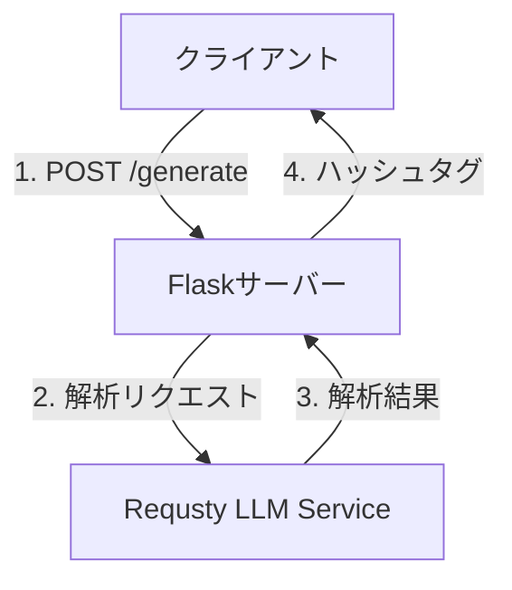

# システム設計書

## 1. システムアーキテクチャ

### 1.1 全体構成


### 1.2 コンポーネント構成
- **フロントエンド**
  - 静的HTML/CSS/JavaScript
  - TailwindCSSによるスタイリング
  - フォーム処理とAPI通信

- **バックエンド**
  - Flaskアプリケーション
  - RESTful API
  - 外部APIとの通信

- **外部サービス**
  - Requsty LLM Routing Service
  - Railway（ホスティング）

## 2. データフロー

### 2.1 ハッシュタグ生成フロー
1. ユーザーがInstagram URLを入力
2. フロントエンドがバックエンドにリクエスト送信
3. バックエンドがRequstyサービスに解析リクエスト
4. 解析結果を受け取り、ハッシュタグを生成
5. 生成されたハッシュタグをフロントエンドに返却
6. フロントエンドで結果を表示

### 2.2 データ構造
```json
// リクエスト
{
  "url": "string",      // Instagram投稿URL
  "language": "string", // "ja" or "en"
  "count": "number"     // 1-30
}

// レスポンス
{
  "hashtags": [
    "string"           // 生成されたハッシュタグ配列
  ]
}
```

## 3. 主要コンポーネントの詳細

### 3.1 フロントエンド
#### UI構成
- URLフォーム
- 言語選択（ラジオボタン）
- 生成数選択（プルダウン）
- 結果表示エリア
- コピーボタン

#### イベントハンドリング
- フォーム送信
- エラー処理
- クリップボードコピー
- ローディング状態管理

### 3.2 バックエンド
#### エンドポイント
- `GET /`: メインページ表示
- `POST /generate`: ハッシュタグ生成

#### エラーハンドリング
- 無効なURL
- API通信エラー
- パラメータバリデーション

### 3.3 外部API連携
#### Requsty LLM Service
- 画像解析
- テキスト解析
- ハッシュタグ生成ロジック

## 4. セキュリティ考慮事項

### 4.1 API認証
- Requsty APIキーの環境変数管理
- Railway上でのシークレット管理

### 4.2 入力バリデーション
- URLフォーマットの検証
- パラメータ範囲の検証
- XSS対策

### 4.3 レート制限
- API呼び出しの制限
- DoS対策

## 5. パフォーマンス最適化

### 5.1 フロントエンド
- TailwindCSSのCDN利用
- 非同期処理の適切な実装
- エラーハンドリングの最適化

### 5.2 バックエンド
- リクエストのバリデーション
- エラーレスポンスの適切な処理
- キャッシュ戦略の検討

## 6. 監視と運用

### 6.1 ログ管理
- アプリケーションログ
- エラーログ
- アクセスログ

### 6.2 メトリクス
- レスポンスタイム
- エラーレート
- API使用量