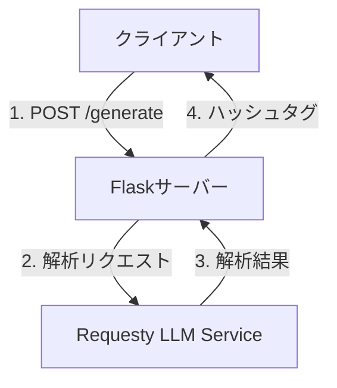
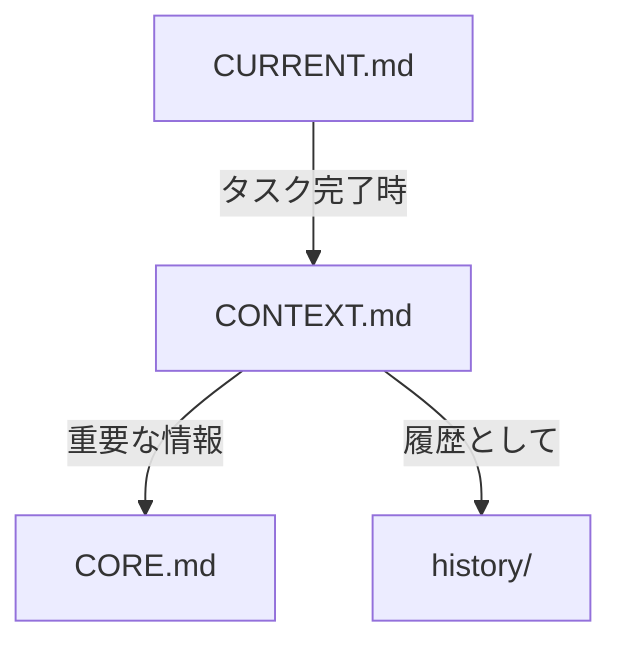

# システム設計書

## 1. システムアーキテクチャ

### 1.1 全体構成


### 1.2 コンポーネント構成
- **フロントエンド**
  - 静的HTML/CSS/JavaScript
  - TailwindCSSによるスタイリング
  - フォーム処理とAPI通信

- **バックエンド**
  - Flaskアプリケーション
  - RESTful API
  - 外部APIとの通信

- **外部サービス**
  - Requesty LLM Routing Service
  - Railway（ホスティング）

## 2. データフロー

### 2.1 ハッシュタグ生成フロー
1. ユーザーがInstagram URLを入力
2. フロントエンドがバックエンドにリクエスト送信
3. バックエンドがRequestyサービスに解析リクエスト
4. 解析結果を受け取り、ハッシュタグを生成
5. 生成されたハッシュタグをフロントエンドに返却
6. フロントエンドで結果を表示

### 2.2 データ構造
```json
// リクエスト
{
  "url": "string",      // Instagram投稿URL
  "language": "string", // "ja" or "en"
  "count": "number"     // 1-30
}

// レスポンス
{
  "hashtags": [
    "string"           // 生成されたハッシュタグ配列
  ]
}
```

## 3. 主要コンポーネントの詳細

### 3.1 フロントエンド
#### UI構成
- URLフォーム
- 言語選択（ラジオボタン）
- 生成数選択（プルダウン）
- 結果表示エリア
- コピーボタン

#### イベントハンドリング
- フォーム送信
- エラー処理
- クリップボードコピー
- ローディング状態管理

### 3.2 バックエンド
#### エンドポイント
- `GET /`: メインページ表示
- `POST /generate`: ハッシュタグ生成

#### エラーハンドリング
- 無効なURL
- API通信エラー
- パラメータバリデーション

### 3.3 外部API連携
#### Requesty LLM Service
- 画像解析
- テキスト解析
- ハッシュタグ生成ロジック

## 4. セキュリティ考慮事項

### 4.1 API認証
- Requesty APIキーの環境変数管理
- Railway上でのシークレット管理

### 4.2 入力バリデーション
- URLフォーマットの検証
- パラメータ範囲の検証
- XSS対策

### 4.3 レート制限
- API呼び出しの制限
- DoS対策

## 5. パフォーマンス最適化

### 5.1 フロントエンド
- TailwindCSSのCDN利用
- 非同期処理の適切な実装
- エラーハンドリングの最適化

### 5.2 バックエンド
- リクエストのバリデーション
- エラーレスポンスの適切な処理
- キャッシュ戦略の検討

## 6. 監視と運用

### 6.1 ログ管理
- アプリケーションログ
- エラーログ
- アクセスログ

### 6.2 メトリクス
- レスポンスタイム
- エラーレート
- API使用量

## 7. ドキュメント管理の改善提案

### 7.1 新しいディレクトリ構造
```
docs/
├── active/
│   ├── CONTEXT.md     # 現在のセッションに必要な最小限の文脈
│   └── CURRENT.md     # 進行中のタスクと状態
├── core/
│   └── CORE.md        # プロジェクトの基本情報（変更頻度低）
├── technical/         # 技術的な決定事項（参照用）
│   ├── ADR.md
│   └── DESIGN.md
└── history/          # 履歴情報（アーカイブ用）
    ├── CHANGELOG.md
    └── issues/
```

### 7.2 各ファイルの役割と運用方針

#### CONTEXT.md
- セッション単位での文脈管理
- タスクに必要な最小限の情報のみを保持
- セッション終了時に重要な情報をCORE.mdに統合
- 一時的な作業メモやデバッグ情報の保管

#### CURRENT.md
- 進行中のタスクの状態管理
- タスクの目的と期待される結果の記録
- 試行錯誤の過程の記録
- タスク完了時に適切な場所へ情報を移動

### 7.3 情報の流れ


### 7.4 期待される効果
1. トークン消費の最適化
   - セッションごとに必要な情報のみを保持
   - 重複した文脈の読み込みを防止
   - 効率的な情報の再利用

2. 文脈の効率的な管理
   - タスクに関連する情報の明確な分離
   - 情報の鮮度に基づく適切な配置
   - 必要な情報への素早いアクセス

3. diffエラーの低減
   - 変更範囲の最小化
   - 文脈の明確な境界設定
   - 競合の可能性の低減

### 7.5 実装計画
1. 段階的な移行
   - 新しいディレクトリ構造の作成
   - 既存の文書の分類と移動
   - 運用ルールの確立

2. 自動化の検討
   - セッション開始時の文脈集約
   - タスク完了時の情報整理
   - アーカイブ処理の自動化

3. 検証項目
   - トークン消費量の測定
   - 文脈把握の効率性評価
   - diffエラーの発生頻度確認

この提案は次のタスクで具体的な実装を行う予定です。